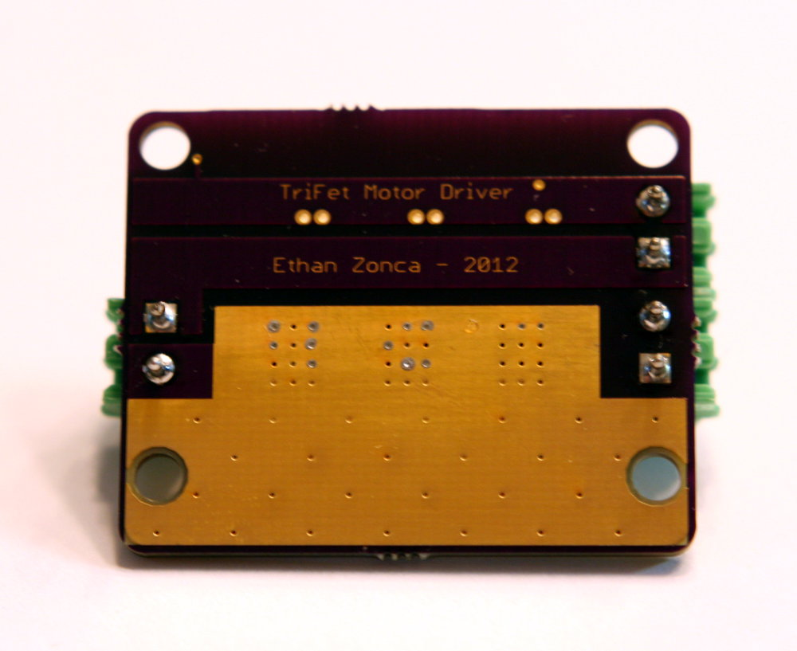
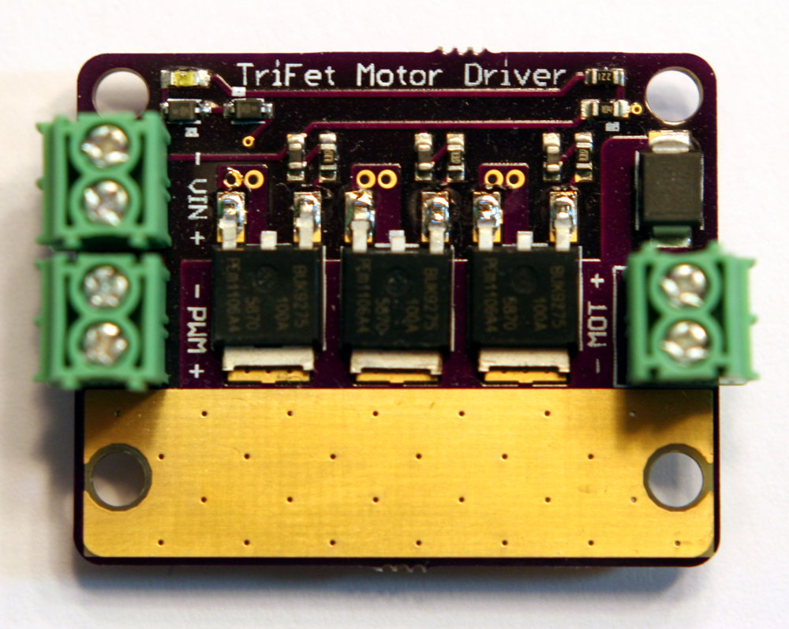
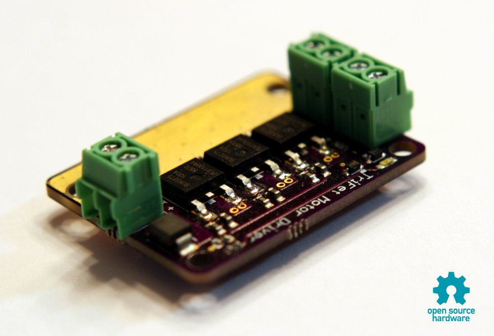
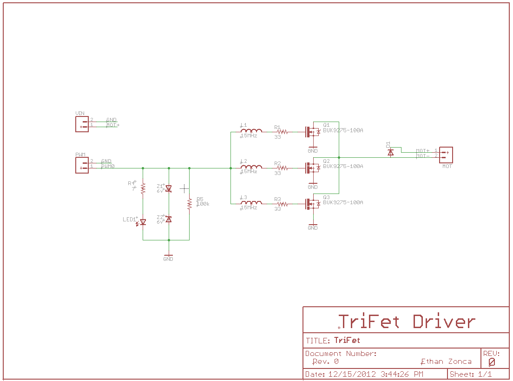

TriFet Motor Driver
-------------------

All credit goes to [Ethan Zonca](http://protofusion.org/), who released the design as Open Source Hardware. Kudos, sir!

Original [TriFet Repository](http://protofusion.org/hg/TriFet/) (Mercurial)

This is my own bit of hacking on it to use as an alternative motor driver for Nerf guns in case my [Polulu High-Power Motor Driver 18v15 (G1)](https://www.pololu.com/product/755) ever lets out the blue smoke. It's special because the G2 drivers all include current choppers, which limits the initial enormous inrush current from the high-power, unprotected RC batteries I'm using (similar to those used in drones). With the current chopper on the VNH5019 (first driver I used), except for absurdly low PWM values, the motor would "warbble" as it kept hitting the limit, backing off, and hitting it again. The G2 custom drivers also include a similar current chopper, hence the desire to avoid it.

I'm trying to optimize for spin-up speed, as the main drawback to motorized Nerf blasters are the noise they make when the flywheels are on. While this could potentially be silenced, it would require a complete overhaul and is sorta out of the realm of a \<\$100 plastic "toy" mod. If I can get \< 1 second spin-up time, I'll probably be happy.
